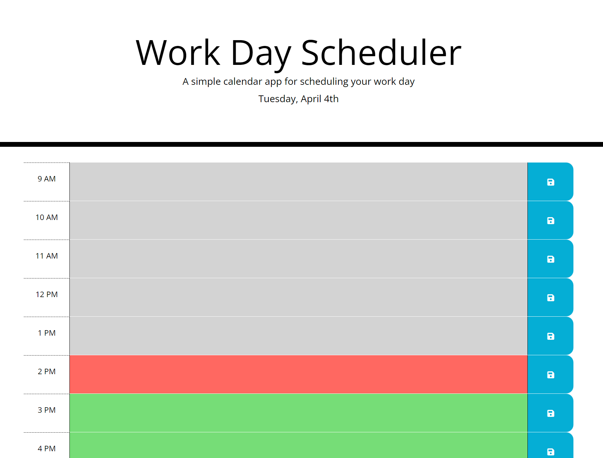
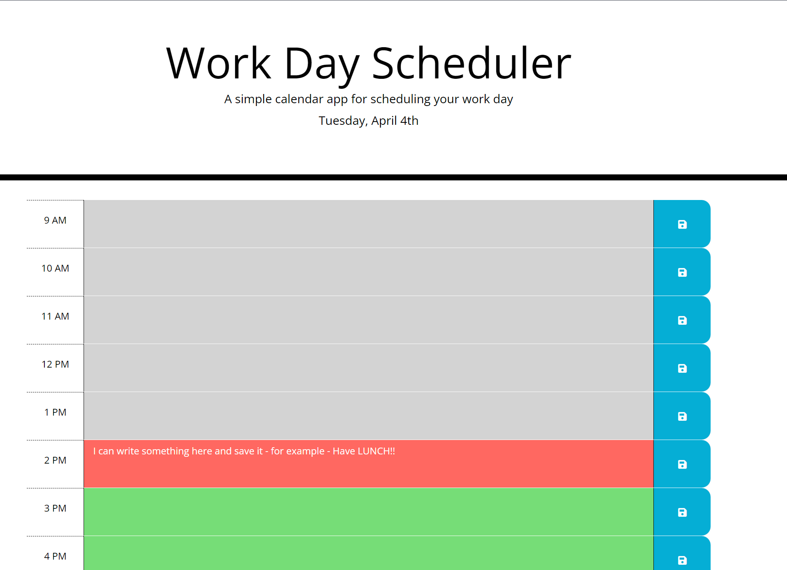

# Module-7-Challenge-Third-Party-APIs-Work-Day-Scheduler

# Third Party APIs Work Day Scheduler

## Description

I was tasked with creating a Work Day Scheduler by using the various framworks of JavaScript - namely jQuery and Moment.js to dynamically create, update, track and save the HTML elements and apply CSS classes on the page. The Work Day Planner is a simple calendar. I attempted to follow the same structure as illustrated in the demo we were provided:

The App runs in the browser and allows the user to save what they've entered. They can refresh the page or even close the tab and the changes will persist.

The layout consists of the Hours on the left, Text in the center and the Save button on the right. At the top of the page there is Today's Date underneath the title.

## Installation
Please visit this URL to see how the Application looks now: https://halcyonlegion.github.io/Module-7-Challenge-Third-Party-APIs-Work-Day-Scheduler/

## Usage

The Challenge is comprised of just the core 3 files. The structure is as I've followed previously with the Index HTML page at the root and the other folders contained within the assets folder. The user may simply use the app straight away by typing into any blank text box and clicking the save icon.

Upon first loading the Scheduler it will appear like this this:

You can identify the Past, Present and Future by looking at the Colors, as there is no actual timer present on the page.

Grey = Past
Red = Present
Green = Future

While I've seen examples of timers on pages and it might be something people may want, I personally find them incredibly distracting.

## Credits

Usual credits to the teaching staff and support we've recieved over the last few weeks particularly with JavaScript, jQuery and Moment.js.

The University of Birmingham provided the materials and guides I used to get this started: https://www.birmingham.ac.uk/index.aspx

To the incredible people who contribute to Stack Overflow: https://stackoverflow.com/

Fontawesome for providing that nice Save Icon on the Save Button: https://fontawesome.com/v5/icons/save?f=classic&s=solid

The creators of the MDN: https://developer.mozilla.org/en-US/

W3 Schools: https://www.w3schools.com/

License
There is no license specified for this project.
